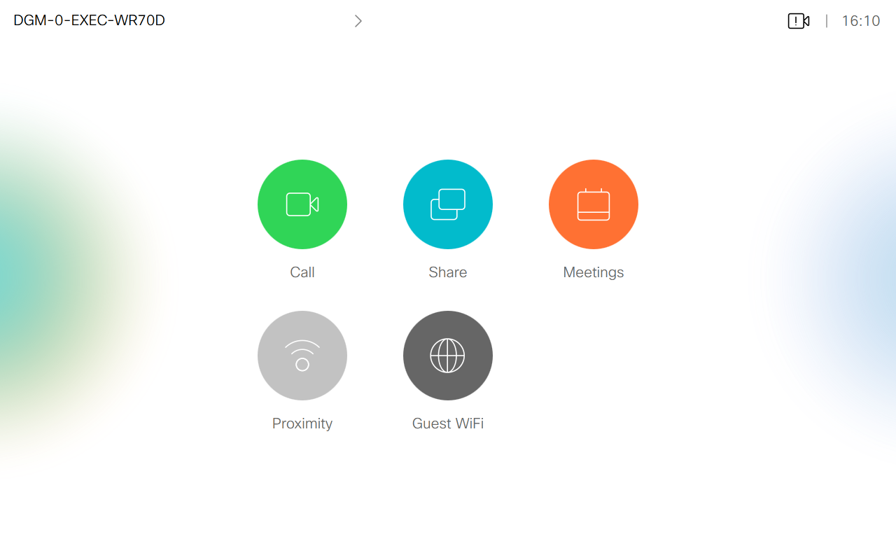
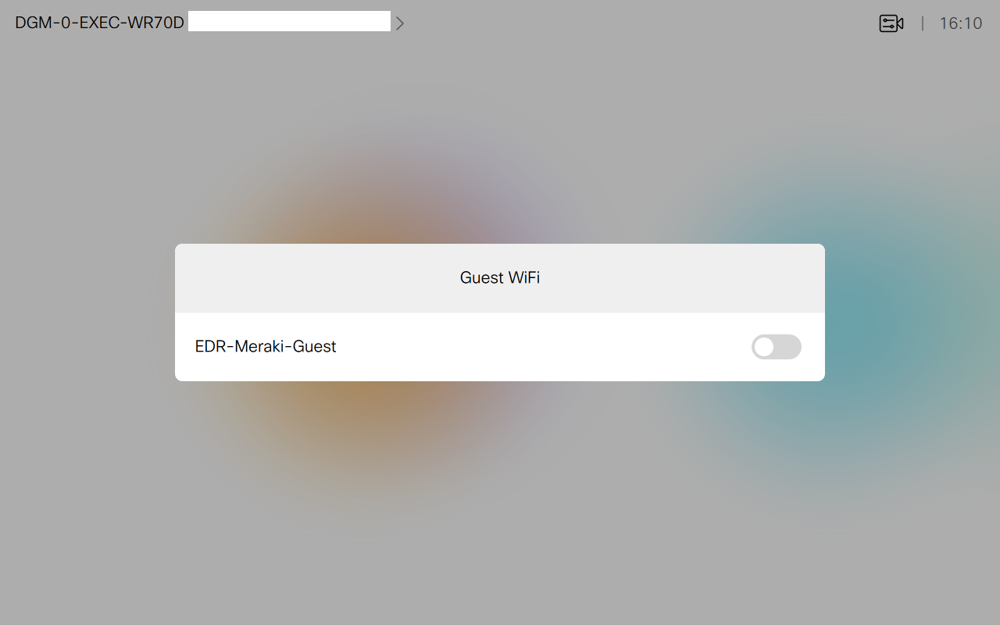
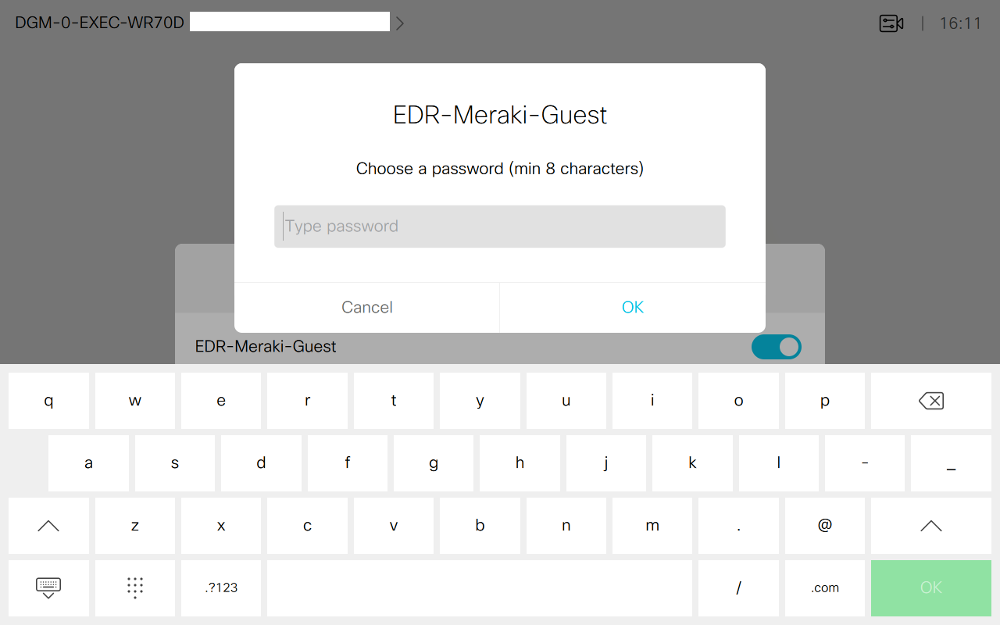

# Improve Guest WiFi Experience

## Description
Add a "Guest WiFi" button on any Cisco Webex device to enable a Cisco Meraki SSID (and push a new PSK key).

Here below is a representation of the user experience from a Touch 10.

The user first clicks on the *Guest WiFi* button. 

It opens up a panel displaying the SSID name (e.g. *EDR-Meraki-Guest*) and a switch button to enable/disable the SSID. 

When enabling the SSID, a prompt asking to choose a password will appear (the passwork needs to be longer than eight characters).

Once done, the user can connect to the SSID with the chosen PSK key.

## Prerequisites

- A Cisco Webex device running at least CE 9.6.1 with admin access
- A Cisco Meraki AP with admin access to the dashboard
- Be on the same local network as the device for the setup

## Cisco Meraki Setup

1. Retrieve your Cisco Meraki Dashboard API key as explained [here](https://developer.cisco.com/meraki/api/#/rest/getting-started).
2. Create an SSID as described in [this article](https://documentation.meraki.com/MR/WiFi_Basics_and_Best_Practices/Configuring_Simple_Guest_and_Internal_Wireless_Networks), give it a name (*EDR-Meraki-Guest* in this example ) and choose *WPA2-PSK* as encryption method.

## Cisco Webex Setup

1. Access the local web interface of the Cisco Webex device ([procedure](https://help.webex.com/en-us/n5pqqcm/Advanced-Settings-for-Room-and-Desk-Devices))
2. Enable the HTTP client:
> Setup > Configuration > HttpClient > AllowInsecureHTTPS > True
and
> Setup > Configuration > HttpClient > Mode > On
3. Enable macros:
> Setup > Configuration > AutoStart > On
and
> Setup > Configuration > Mode > On
